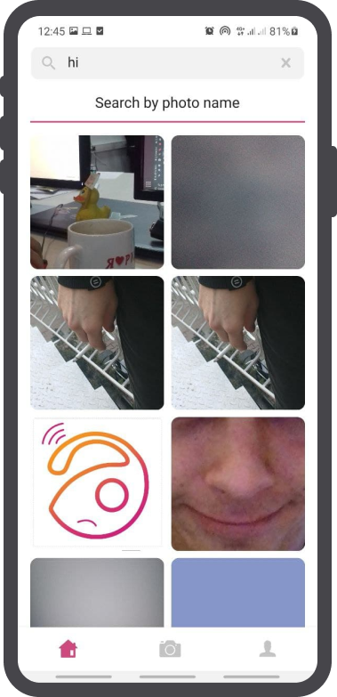

# Screenshots

Тестовое задание Gallery.

Разработать мобильное приложение, которое соответствует следующим требованиям:

1) Имеет splash screen с лого компании.
2) Имеет экран приветствия.
3) Имеет экран Входа.
4) Имеет экран регистрации.
5) Имеет табы с нижней навигацией.
6) Первый таб содержит две вкладки New & Popular:
7) Второй таб содержит создание фото и выгрузку его на бэк (теги делать не нужно).
   Нужно выводить сразу этот дизайн
   https://www.figma.com/file/U0oHcjTijoYRdTNJpI1blY/Тестовое-Gallery?node-id=761%3A886
8) Третий таб содержит профиль(общее кол-во просмотров можно не делать, общее
   кол-во загруженных фото можно взять с поля “totalItems”, подгружать все загруженные
   фото с бэка для текущего юзера).
9) Создать подробный экран просмотра фотографии.
10) Сделать экран настройки профиля.
11) Сделать экран профиля.
12) Сделать поиск.
13) Вывод кэшированных данных при отсутствии интернета (если есть, иначе
    плейсхолдер).
14) Сделать смену пароля.
15) Сделать диалог загрузки при действиях (например, при нажатии на выгрузку файла
    на бэк или изменении настроек профиля)
    
По коду:
1) Придерживаться чистой архитектуры.
2) Разбить модули по чистой архитектуре.
3) Придерживаться принципам SOLID.
4) Использовать паттерн проектирования bloc (от Феликса
   (https://pub.dev/packages/flutter_bloc)).
5) Использовать di.
6) Создать базовую обработку ошибок с бэка и вывод их в ui.
7) + к 6 пункту выводить ошибки с бэка через диалоги (например создание фото,
     редактирование профиля).
8) Сделать базовые блоки получения фотографий.
9) Сделать базовую работу получения фотографий (абстракцию) .
10) Кэшировать данные фотографий, которые получили с бэка (можно без фото, но
    остальные данные обязательно (название, описание и тд)), и юзера.
11) Добавить локализацию.
12) Валидаци инпутов через bloc.
13) Сделать базовую обработку инпутов.
14) Сделать базовую модель для пагинации.
15) Использовать интерсептор.
16) Создать и выносить ресурсы (например, строки, стили для текстов, ассеты).

P.S.
- Загрузка фотографий имеет пагинацию. Приложение должно подгружать не сразу
  все изображения, а по 10 за один запрос. При прокрутке страницы до последнего
  видимого элемента должен отображаться ProgressBar и делаться новый запрос на
  получение следующей партии изображений.
- При отсутствии интернета должна выводиться картинка об отсутствии интернет
  соединения (Пример имеется в дизайне).
- Профиль и первый таб имеет PullRefresh: приложение очищает предыдущие данные
  и заново делает запрос.
- При нажатии на изображение открывается экран подробной информации об
  изображении, где содержится само изображение, его название и описание.
  http://gallery.dev.webant.ru/api - апи для изображений
  https://www.figma.com/file/U0oHcjTijoYRdTNJpI1blY/Тестовое-Gallery?node-id=761%3A886
  %D0%BE%D0%B2%D0%BE%D0%B5-Gallery?node-id=761%3A886 - figma
  Будут плюсом:
- добавить теги (локально или через firebase)
- добавить кол-во просмотров на фотографии (локально или через firebase)

# Don't forget connect Firebase :)
